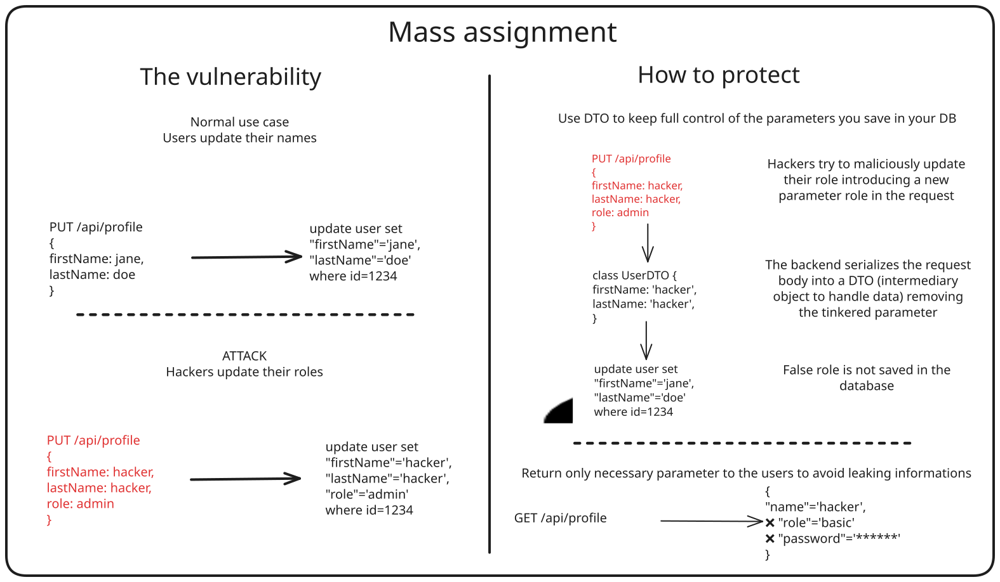

# From Amateur Driver to FIA Admin

The FIA has a web application to manage all its drivers—both professional and amateur. Since it's open to the public, anyone can create an account.

A couple of security researchers did just that, and while poking around the app, they noticed that all profile modifications go through a single endpoint: PUT /api/user.
This immediately raised a red flag: could this be vulnerable to **Mass Assignment**?

**How the vulnerability works:** A modification endpoint accepts more fields than it should. An attacker can sneak in extra parameters—like a role field—to escalate from a regular user to an administrator.

And that's exactly what happened here. After some more digging, our two researchers crafted a payload that elevated their privileges to admin level. Suddenly, they had access to everyone's documents—including those of professional drivers like Max Verstappen.

How to protect yourself:
- Whitelist the fields you allow users to modify—don't trust incoming data blindly
- Add strict validation on the objects received by your endpoints
- Minimize the information you expose to users; too much detail can help attackers plan their next move

Sources:
- [Article disclosing the vulnerability](https://ian.sh/fia)
- [Mass Assignment on OWASP](https://owasp.org/www-community/vulnerabilities/Mass_Assignment)